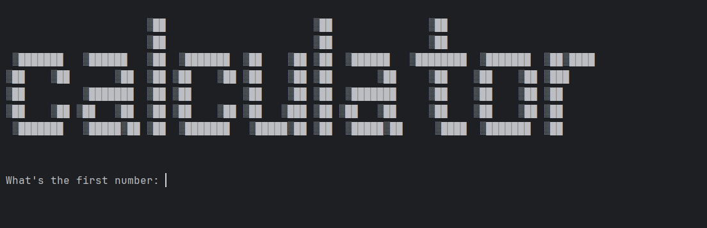
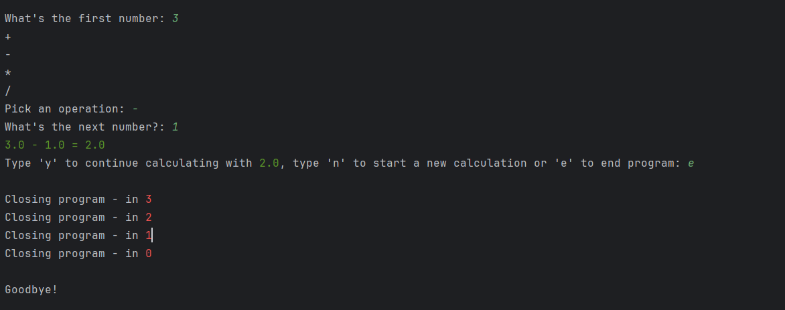

## Console Calculator (Python)

Prosty kalkulator konsolowy napisany w Pythonie, obsługujący podstawowe działania matematyczne: dodawanie, odejmowanie, mnożenie i dzielenie. Program wykorzystuje bibliotekę `colorama` do kolorowania komunikatów w terminalu oraz posiada walidację danych wejściowych i możliwość kontynuowania obliczeń na poprzednim wyniku.

---

## Cel projektu

Celem projektu jest stworzenie funkcjonalnego kalkulatora działającego w terminalu, który:

- wykonuje podstawowe operacje matematyczne,
- obsługuje błędy użytkownika (np. wpisanie tekstu zamiast liczby),
- umożliwia kontynuowanie obliczeń na poprzednim wyniku,
- pozwala rozpocząć nowe obliczenia lub zakończyć program,
- prezentuje pracę z funkcjami, pętlami oraz walidacją danych.

Projekt pełni rolę edukacyjną i pokazuje znajomość podstaw programowania proceduralnego w Pythonie.

---

## Technologie

- **Python 3**
- **colorama** – kolorowanie tekstu w terminalu
- **time** – opóźnienia przy zamykaniu programu
- **input/output** – interakcja z użytkownikiem

---

## Zrzuty ekranu

### Uruchomienie kalkulatora


*Ekran startowy kalkulatora z wyświetlonym logo oraz pierwszym polem do wprowadzenia liczby.*


### Zamykanie programu


*Widok końcowy programu z odliczaniem czasu do zamknięcia aplikacji.*


---

## Funkcjonalności

- Dodawanie, odejmowanie, mnożenie i dzielenie.
- Walidacja danych wejściowych (obsługa błędów).
- Kolorowe komunikaty w terminalu (błędy, wyniki).
- Kontynuacja obliczeń na poprzednim wyniku.
- Restart kalkulatora bez ponownego uruchamiania programu.
- Bezpieczne zakończenie działania z odliczaniem.

---

## Struktura projektu

- `main.py` – logika kalkulatora, obsługa błędów, pętla główna i funkcje matematyczne.

---

## Uruchomienie

Instalacja zależności:

```bash
pip install colorama
```

Uruchomienie programu:

```bash
python main.py
```

---

## Możliwe ulepszenia

- dodanie historii obliczeń,
- zapis wyników do pliku,
- obsługa bardziej zaawansowanych operacji matematycznych,
- przekształcenie do wersji obiektowej,
- stworzenie wersji GUI (tkinter / ttkbootstrap).
